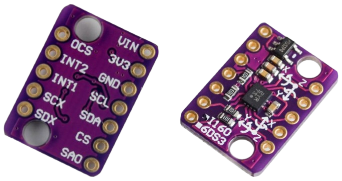
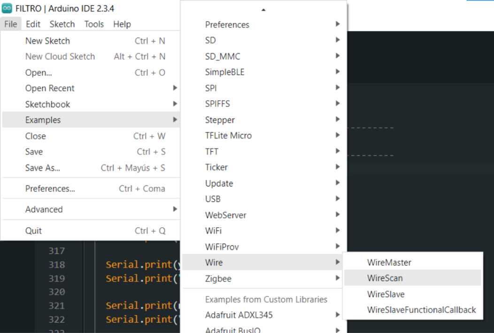
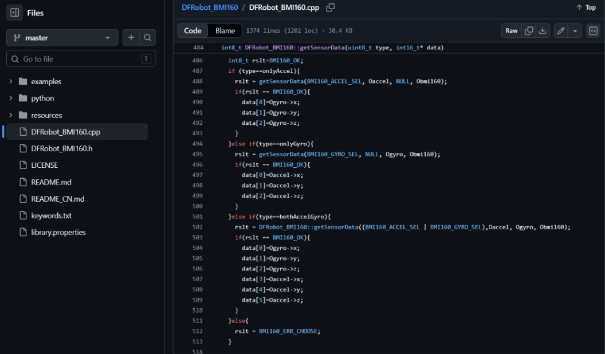
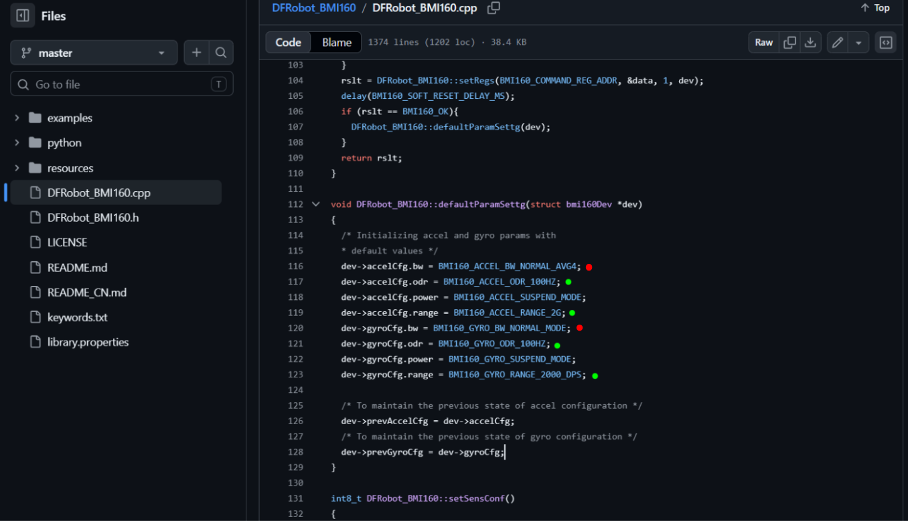
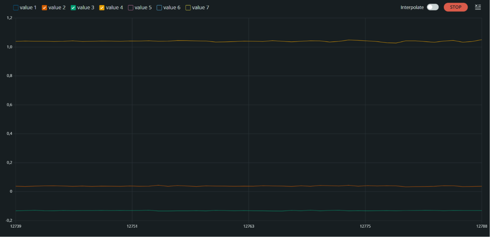
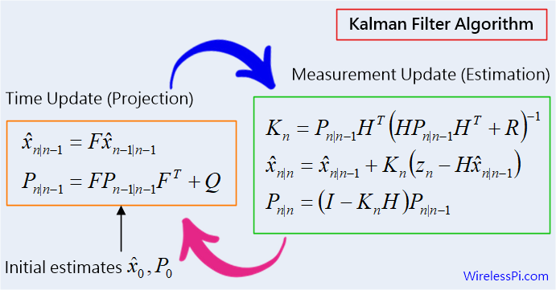

# FILTRO KALMAN PARA IMU BMI160

En el siguiente documento se detalla el proceso de creación de filtros de Kalman para la IMU BMI 160, la cual cuenta con giróscopo y acelerómetro.

<p align="center">
  
</p>

Donde, entendiendo los pines, si el microcontrolador tiene un nivel lógico de salida de 3.3V, se conecta al pin 3v3, de lo contrario a Vin, ya que tiene regulador de voltaje incluido, de ningún modo los dos al tiempo, luego el GND a tierra, SCL serial clock y SDA serial data que tienen sus puertos específicos para ser leídos en la ESP32, SAO que es el address select, el cuál cambia la dirección de hardware específico del sistema dependiendo si el sistema está en GND o 3v3. Esto puede variar ya que depende de modelo exacto y fabricación interna, por lo cuál será lo primero que se verificará, el resto de pines corresponden a protocolo SPI, el cual no se utilizará debido a que el sensor estará cerca al microcontrolador y es fácilmente programable con librerías estándar, se recomienda cambiar a SPI en aplicaciones que requieran velocidades de transferencia de órdenes mayores a los KB/s.

La primera etapa del diseño consiste en la adquisición de datos mediante el protocolo I2C. Para ello se emplea inicialmente un programa de identificación de dirección hardware, con el fin de determinar la dirección hexadecimal utilizada por el sensor.

<p align="center">
  
</p>

Luego de esto, se leen los datos, para eso se utiliza inicialmente la librería `"DFRobot_BMI160.h"` de DFRobot. La cual lee datos de la siguiente forma:

```cpp
int16_t raw[6];

bmi160.getAccelGyroData(raw);

float ax = raw[3];
float ay = raw[4];
float az = raw[5];

float gx = raw[0];
float gy = raw[1];
float gz = raw[2];
```

Ya que en la propia librería específica que cuando contamos con ambos giróscopo y acelerómetro, lo organiza de la siguiente forma.

<p align="center">
  
</p>

Los datos son de este tipo:

```
Serial.println("ax,ay,az,gx,gy,gz");
-493.00,-2417.00,16934.00,-14.00,8.00,19.00
-500.00,-2296.00,17087.00,-10.00,4.00,21.00
-391.00,-2440.00,17030.00,-12.00,8.00,23.00
-441.00,-2488.00,17110.00,-7.00,6.00,27.00
```

Se muestra que son los datos puros que envía el sensor, pero están en bits de resolución, los cuales cambian con los rangos configurables distintos que tiene esta imu, sin embargo no se configuró ningún rango y aún así muestra los anteriores datos, para verificar que sucede se indaga la librería y se da por sentado que la librería configura automáticamente el rango y no es intercambiable, además que entrega los datos en bits, los cuales tienen distintos valores dependiendo del rango, como muestra el datasheet de Bosch en la siguiente sección, por lo tanto se toma el código base de la librería y se proponen dos modificaciones con Claude: que sea de rango ajustable y que entregue la medida en unidades de gravedad para la aceleración y en grados/s para las velocidades angulares. Se adjunta librería propia modificada.

<p align="center">
  
</p>

<div align="center">

| OUTPUT SIGNAL ACCELEROMETER | | | | | |
|---|---|---|---|---|---|
| **Parameter** | **Symbol** | **Condition** | **Min** | **Typ** | **Units** |
| Resolution | | | | 16 | bit |
| Sensitivity | S₂g | g_FS2g, Tₐ=25°C | 15729 | 16384 | 17039 | LSB/g |
| | S₄g | g_FS4g, Tₐ=25°C | 7864 | 8192 | 8520 | LSB/g |
| | S₈g | g_FS8g, Tₐ=25°C | 3932 | 4096 | 4260 | LSB/g |
| | S₁₆g | g_FS16g, Tₐ=25°C | 1966 | 2048 | 2130 | LSB/g |

</div>

*Tabla 1: Señal de salida del acelerómetro — Bosch BMI160 Datasheet.*

<div align="center">

| OUTPUT SIGNAL GYROSCOPE | | | | | |
|---|---|---|---|---|---|
| **Parameter** | **Symbol** | **Condition** | **Min** | **Typ** | **Max** | **Units** |
| Sensitivity | R_FS2000 | Tₐ=25°C | 15.9 | 16.4 | 16.9 | LSB/°/s |
| | R_FS1000 | Tₐ=25°C | 31.8 | 32.8 | 33.8 | LSB/°/s |
| | R_FS500 | Tₐ=25°C | 63.6 | 65.6 | 67.6 | LSB/°/s |
| | R_FS250 | Tₐ=25°C | 127.2 | 131.2 | 135.2 | LSB/°/s |
| | R_FS125 | Tₐ=25°C | 254.5 | 262.4 | 270.3 | LSB/°/s |

</div>

*Tabla 2: Señal de salida del giróscopo — Bosch BMI160 Datasheet.*

---

## Caracterización

Ahora se prueba con la librería propia la toma de datos, aquí es donde se inicia el proceso de caracterización, con esto se tomarán datos de la imu, en estado estático y se comprobará realmente la fidelidad de los datos.

Los datos que surgieron son del siguiente tipo:

```
Serial.println("t,ax,ay,az,gx,gy,gz");
60380811,-0.026733,-0.133484,1.042114,-0.419207,-0.068598,1.440549
60392811,-0.027771,-0.132507,1.038940,-0.708842,0.304878,1.379573
60404811,-0.029480,-0.134033,1.035583,-0.785061,0.457317,1.379573
60416811,-0.029663,-0.133606,1.040161,-0.403963,0.000000,1.455793
```
Los resultados muestran que las mediciones de aceleración se encuentran expresadas directamente en unidades de gravedad y presentan valores cercanos a los esperados para una condición estática. Esto se debe a una etapa de filtrado de 4 datos antes de mostrar el resultado, la menor variabilidad observada en las mediciones del acelerómetro es consistente con la configuración de ancho de banda empleada por la librería, la cual utiliza el modo `BMI160_ACCEL_BW_NORMAL_AVG4`, mientras que el giroscopio es configurado mediante `BMI160_GYRO_BW_NORMAL_MODE`. Esta diferencia en la configuración interna contribuye a que las mediciones de aceleración presenten una apariencia más estable que las mediciones de velocidad angular y el hallazgo importante es que se aprecia el bias que existe, por lo tanto, para sacar el bias y más adelante otros datos se hace una toma de 3 minutos de datos para la caracterización.

<p align="center">
  
</p>

---

## Entender modelo lineal

Ahora se busca construir un filtro de Kalman lineal que permita estimar los ángulos de nuestro sensor, esto puede tener aplicaciones distintas, como el control por ángulo en un guante, estimación de ángulos en drones, entre otros.

Sin embargo, se debe empezar a construir el modelo matemático que sentará las bases del filtro de Kalman. Para esto lo primero es partir de nuestro vector de estados, con la pregunta ¿Qué se pretende medir?

Para un primer acercamiento al Kalman lineal se propone que:

$$\theta' = \omega_{real}$$

dadas nuestras observaciones sabemos que:

$$\omega_{real} = \omega_{gyro} - \delta - \eta$$

siendo $\delta$ el bias y $\eta$ es el ruido del giróscopo.

Donde el bias es constante, y su variación se denota con ruido:

$$\delta' = \eta_g$$

Se propone una discretización por Euler hacia adelante:

$$\frac{\theta[k+1] - \theta[k]}{\Delta t} = \omega_{gyro}[k] - \delta[k]$$

$$\theta[k + 1] = \theta[k] + (\omega_{gyro}[k] - \delta[k])\Delta t$$

$$\frac{\delta[k+1] - \delta[k]}{\Delta t} = 0 \implies \delta[k + 1] = \delta[k] + \eta_b \text{, siendo que } \eta_b = \eta_g \cdot \Delta t$$

De esta última ecuación se analiza que $\omega_{gyro}$ es nuestra variable sensada, las otras serán por consiguiente las variables de estado.

$$\theta_x[k + 1] = \theta_x[k] + \omega_x^{gyro}[k] \cdot \Delta t - \delta_x[k] \cdot \Delta t + \eta_x$$

$$\theta_y[k + 1] = \theta_y[k] + \omega_y^{gyro}[k] \cdot \Delta t - \delta_y[k] \cdot \Delta t + \eta_y$$

$$\theta_z[k + 1] = \theta_z[k] + \omega_z^{gyro}[k] \cdot \Delta t - \delta_z[k] \cdot \Delta t + \eta_z$$

$$\delta_x[k + 1] = \delta_x[k] + \eta_{bx} \qquad \delta_y[k + 1] = \delta_y[k] + \eta_{by} \qquad \delta_z[k + 1] = \delta_z[k] + \eta_{bz}$$

Se plantea entonces la ecuación completa de variables de estado discreta de Kalman y se renombran los ángulos en xyz por alabeo, cabeceo y guiñada respectivamente:

$$x_{k+1} = Fx_k + Gu_k + \eta_k$$

$$\begin{bmatrix} \phi_{k+1} \\ \theta_{k+1} \\ \psi_{k+1} \\ b_{x,k+1} \\ b_{y,k+1} \\ b_{z,k+1} \end{bmatrix} = \underbrace{\begin{bmatrix} 1 & 0 & 0 & -\Delta t & 0 & 0 \\ 0 & 1 & 0 & 0 & -\Delta t & 0 \\ 0 & 0 & 1 & 0 & 0 & -\Delta t \\ 0 & 0 & 0 & 1 & 0 & 0 \\ 0 & 0 & 0 & 0 & 1 & 0 \\ 0 & 0 & 0 & 0 & 0 & 1 \end{bmatrix}}_{F} \begin{bmatrix} \phi_k \\ \theta_k \\ \psi_k \\ b_{x,k} \\ b_{y,k} \\ b_{z,k} \end{bmatrix} + \underbrace{\begin{bmatrix} \Delta t & 0 & 0 \\ 0 & \Delta t & 0 \\ 0 & 0 & \Delta t \\ 0 & 0 & 0 \\ 0 & 0 & 0 \\ 0 & 0 & 0 \end{bmatrix}}_{G} \begin{bmatrix} \omega_{x,k} \\ \omega_{y,k} \\ \omega_{z,k} \end{bmatrix} + \begin{bmatrix} \eta_{\phi,k} \\ \eta_{\theta,k} \\ \eta_{\psi,k} \\ \eta_{bx,k} \\ \eta_{by,k} \\ \eta_{bz,k} \end{bmatrix}$$

$$\eta_k \sim \mathcal{N}(0, Q)$$

Ya lista la primera ecuación de estados se procede a la segunda ecuación de estados, que para Kalman es la de observación, donde la matriz de observabilidad es crucial, para esto se plantea la pregunta: ¿Las medidas que estoy haciendo qué relación tienen con las variables de estado? Para esta pregunta, sabemos que la BMI160 tiene 6DOF, los cuales 3 fueron ya usados para predicción, que son los del gyro, ahora los otros 3 serán usados para corrección, los de aceleración.

Dado a que se tiene una aceleración constante de gravedad, como se muestra en la figura de toma de datos, el cambio de estos datos para cuando la imu está en estado de aceleración lineal despreciable o en reposo, las proyecciones de la aceleración gravitacional sobre los ejes del sensor contienen información directa acerca de la orientación del dispositivo, sin embargo esto solo sucede para alabeo y cabeceo, porque al cambiar el sensor de posición en guiñada, la componente de gravedad no cambia. Por lo tanto solo tendremos corrección en estos dos, y aceptaremos que habrá un drift incorregible para la guiñada por inobservabilidad.

La relación trigonométrica para las proyecciones en alabeo y cabeceo derivadas de la aceleración serán las siguientes:

$$\phi_{acc} = \text{atan2}(a_y, a_z) \qquad \theta_{acc} = \text{atan2}\left(-a_x, \sqrt{a_y^2 + a_z^2}\right)$$

Las cuales teóricamente deberían ser iguales a los valores en los primeros dos estados más un ruido de medición, por lo que:

$$z_k = Hx_k + v_k$$

$$\underbrace{\begin{bmatrix} \phi_{acc} \\ \theta_{acc} \end{bmatrix}}_{\text{Observación}} = \underbrace{\begin{bmatrix} 1 & 0 & 0 & 0 & 0 & 0 \\ 0 & 1 & 0 & 0 & 0 & 0 \end{bmatrix}}_{H} \underbrace{\begin{bmatrix} \phi \\ \theta \\ \psi \\ b_x \\ b_y \\ b_z \end{bmatrix}}_{\text{Estado}} + \underbrace{\begin{bmatrix} v_\phi \\ v_\theta \end{bmatrix}}_{\text{Ruido de medición}}$$

$$v_k \sim \mathcal{N}(0, R)$$

Ahora, lo único en matrices que falta por definir son Q y R, las cuales se hallarán desde un programa que caracterizará desde MATLAB los bias, y las varianzas de nuestras mediciones de forma automática.

---

## Valores de Matrices

Finalmente posterior al análisis en MATLAB, las matrices del filtro Kalman quedan definidas como:

$$\Delta t = 0.0120 \text{ s} \quad \text{(83 Hz)}$$

$$F = \begin{bmatrix} 1 & 0 & 0 & -0.0120 & 0 & 0 \\ 0 & 1 & 0 & 0 & -0.0120 & 0 \\ 0 & 0 & 1 & 0 & 0 & -0.0120 \\ 0 & 0 & 0 & 1 & 0 & 0 \\ 0 & 0 & 0 & 0 & 1 & 0 \\ 0 & 0 & 0 & 0 & 0 & 1 \end{bmatrix} \qquad G = \begin{bmatrix} 0.0120 & 0 & 0 \\ 0 & 0.0120 & 0 \\ 0 & 0 & 0.0120 \\ 0 & 0 & 0 \\ 0 & 0 & 0 \\ 0 & 0 & 0 \end{bmatrix}$$

$$H = \begin{bmatrix} 1 & 0 & 0 & 0 & 0 & 0 \\ 0 & 1 & 0 & 0 & 0 & 0 \end{bmatrix}$$

$$Q = 10^{-8} \begin{bmatrix} 0.0123 & 0 & 0 & 0 & 0 & 0 \\ 0 & 0.0081 & 0 & 0 & 0 & 0 \\ 0 & 0 & 0.0089 & 0 & 0 & 0 \\ 0 & 0 & 0 & 1 & 0 & 0 \\ 0 & 0 & 0 & 0 & 1 & 0 \\ 0 & 0 & 0 & 0 & 0 & 1 \end{bmatrix} \qquad R = \begin{bmatrix} 9.30 \times 10^{-7} & 0 \\ 0 & 1.165 \times 10^{-6} \end{bmatrix}$$

---

## Implementación

Ya una vez obtenidos los datos de caracterización, se digitalizarán en el programa de C++ adjunto que ya aplica el filtro Kalman y gráfica los datos de ángulo en tiempo real.

## Video de implementación

<p align="center">
  <a href="imagenes/implementacion.mp4">
    
  </a>
</p>

---

## Referencias

- Bosch BMI160 Datasheet, BMI160 Data Sheet, Revision 1.0, Bosch Sensortec GmbH, Nov. 2020. [Online]. Available: https://www.bosch-sensortec.com/media/boschsensortec/downloads/datasheets/bst-bmi160-ds000.pdf. [Accessed: 14-Jun-2026]

- DFRobot BMI160 GitHub Repository, DFRobot_BMI160 Arduino Library, DFRobot. [Online]. Available: https://github.com/DFRobot/DFRobot_BMI160. [Accessed: 14-Jun-2026]
